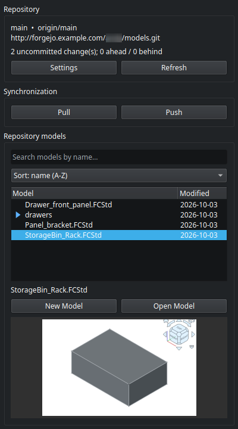
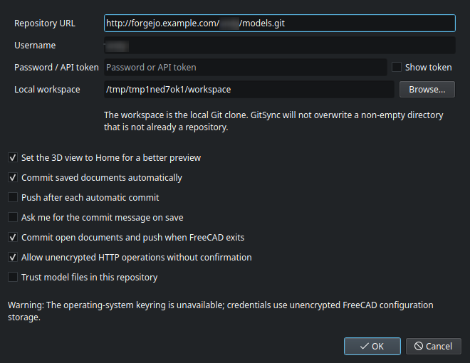
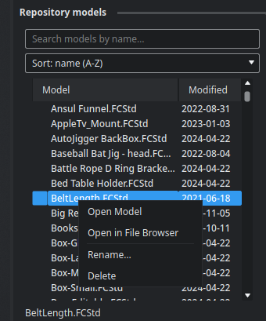

# GitSync for FreeCAD

GitSync is a small FreeCAD workbench for working with a Git repository that
contains FreeCAD and CAD model files. It uses the system `git` executable and
keeps the selected local directory as the repository working tree.

## Features

- Clone an HTTP or HTTPS repository into a chosen local directory.
- Show branch, upstream, ahead/behind counts, and uncommitted changes.
- Commit automatically when a document is saved, with a date/time stamp or your
  own message; pull and push from a dockable panel.
- Fetch and compare local and remote state when FreeCAD starts.
- Offer safe choices for pushing, fast-forward pulling, merging, or rebasing
  divergent branches. Force pushes and destructive resets are not offered.
- Browse `.FCStd`, STEP/STP, IGES/IGS, STL, OBJ, PLY, and BREP files already in
  the working tree, filter them by name, and sort them by name or by the time a
  model was last edited.
- **New Model** creates an empty FreeCAD document directly in the workspace, so
  it is versioned and previewed like every other model.
- Render a compact static preview of the selected model in an isolated
  temporary view and provide an **Open Model** action for normal editing.
- Right-click a model in the list to open its folder in the system file browser.
- Store each preview beside its model as `<model-name>.png`; the panel reuses
  the PNG when it is current and regenerates the PNG of a model when that model
  is committed, in the same commit as the model itself.
- Optionally commit the document that was saved, and optionally push each such
  automatic commit.
- Optionally commit the documents touched in the session and push pending
  commits during FreeCAD shutdown. A failed push is reported and does not
  discard local commits.

## Screenshots

**The dock panel** — branch and upstream, the uncommitted-change count, the model
list with its search box, sort selector and narrow *Modified* column (date only, so
long model names get the width), and a static preview of the selected model.



**Settings** — the repository URL, user name, token, and the local workspace
that becomes the Git working tree, together with preview orientation, automatic
commits, the per-save commit-message prompt, push-after-commit, the exit commit,
and the two trust/security options. It is the only place connection details are
edited; changing them reconnects and clones as needed.



**Model Menu** — the models list had a right-click option that give you the options
to open the model in FreeCAD, open the model in your operating system's fileb rowser,
rename the model or delete the model. The rename and delete commands will take the 
necessary steps to update the local and remote git repository so there is no lingering
files between the two.  



The screenshots are rendered from a throwaway workspace with an example remote, so
no real credentials, tokens, or local paths appear in them.


## Setup

Git must be installed and available on `PATH`. Git must also have a
configured author name and email before the first commit.

Check that git is installed and available on `PATH`
```
❯ git --version
git version 2.56.0
```

Set your git name and email
```
git config --global user.name "Your Name"
git config --global user.email "youremail@yourdomain.com"
```

1. Copy this directory into a FreeCAD `Mod` directory, for example:
   `~/.local/share/FreeCAD/Mod/GitSync` on Linux.
2. Restart FreeCAD and select the **GitSync** workbench.
3. Click **Settings** and enter:
   - the HTTP/HTTPS repository URL,
   - username,
   - password or API token, and
   - the local workspace directory.
   Press OK to connect and clone. In the same dialog, configure preview
   orientation, the automatic commit message, pushes after a commit, and
   shutdown push behavior.

The panel's Repository group holds **Settings** and **Refresh**; connection
details are only edited in **Settings**, which is where the same four fields
appear.

Selecting the workbench puts a **GitSync** toolbar at the top of the window with
the five everyday actions, ordered like the panel's own groups: *Settings*,
*Refresh*, *Pull*, *Push* and *New Model*. The **GitSync** menu additionally
offers *Connect / Clone*, which opens a smaller dialog with just the four
connection fields; *New Model* and *Pull* are also on the command bar.

The workbench tab icon ships with the workbench in `icons/GitSyncWorkbench.svg`;
`InitGui.py` points FreeCAD at it, because FreeCAD only resolves the icons of its
own workbenches by itself.

The first connection clones only into an empty directory. Existing non-empty
directories are never overwritten. GitSync adds FreeCAD backup exclusions to
`.git/info/exclude`, so it does not modify the repository's tracked
`.gitignore`.

Plain `http://` URLs are accepted, but GitSync warns that credentials and
repository data are not encrypted. Prefer `https://` whenever possible. In
**Settings**, enable **Allow unencrypted HTTP operations without confirmation**
to suppress those warnings for pull, startup refresh, commit, and push actions.
This setting only suppresses the confirmation dialog; it does not encrypt the
connection. This version intentionally accepts HTTP and HTTPS clone URLs. SSH
URLs are not checked by the dialogs; `git` itself refuses them, because GitSync
restricts Git to the `http` and `https` protocols.

## Credentials

The optional Python `keyring` package is used when available, allowing tokens
to be stored in the operating-system credential store. If no keyring backend
is available, GitSync falls back to FreeCAD's parameter storage so the token
can persist between sessions; the settings dialog displays that warning. The
fallback is not encrypted. Tokens are never placed in the repository URL or
GitSync log messages. If you change the server URL or username, GitSync clears
the token field and requires it to be entered again for the new target.
Existing Git remotes are checked before authenticated fetch/push/pull
operations.

## Model list

The **Repository models** group has a search box and a sort selector above the
tree:

- **Search** filters the list as you type. The term is matched case-insensitively
  anywhere in a model's repository path, so it finds a model by file name (`rack`)
  as well as by the folder it lives in (`sub/`). Folders without a match are
  hidden, the clear button restores the full list, and a search with no result
  says so instead of showing an empty panel. The search is not remembered between
  sessions, so it can never hide models after a restart.
- **Sort: name (A-Z)** — case-insensitive by repository path. Folders are sorted
  in with the models rather than kept in a block of their own, so a folder named
  `archive` appears between `Apple.FCStd` and `Bracket.FCStd`.
- **Sort: date modified (newest first)** — by the file's last edit time in the
  workspace, not by its commit date. A folder takes the date of the most recently
  edited file it contains, so folders and models interleave by recency and the most
  recently edited row is first. A row with no known date sorts last.

Search and sort combine, so the filtered models are always shown in the chosen
order. Folders and models are ordered as one list: a folder row sits wherever it
belongs among the models rather than in a block of its own, and it shows the date
it is sorted by in the **Modified** column. That column shows dates only
(`YYYY-MM-DD`) and is sized to fit one, which leaves the rest of the width to the
model name. Right-clicking a model offers four actions, with the destructive ones behind a
separator:

- **Open Model** — open it for editing, as the **Open Model** button does.
- **Open in File Browser** — show it in the operating system's own file manager
  with the model itself selected, not just its folder: `open -R` on macOS,
  `explorer /select,` on Windows, and the standard
  `org.freedesktop.FileManager1` D-Bus call on Linux, which Dolphin, Nautilus,
  Nemo, Thunar and PCManFM all implement. If no session bus is available, or the
  file manager does not answer, the containing folder is opened instead.
- **Rename…** — rename it inside its own folder and commit the change as
  `{date} {time} renamed`. The new name is validated exactly as a new model's is,
  an existing file is never overwritten (not even by a change of case alone), and
  the preview PNG is renamed in the same commit.
- **Delete** — remove it after a confirmation and commit it as
  `{date} {time} deleted`, together with its preview PNG.

Both use Git itself — `git mv` for a rename, `git rm` for a delete — so the
repository is left clean straight away rather than accumulating pending
deletions. Because `git rm` is never forced, deleting a model whose changes were
never committed is **refused by Git**, so unsaved work cannot be thrown away by
accident. If **Push after each automatic commit** is enabled, these commits are
pushed too; otherwise they stay local.

Both refuse to act while FreeCAD still holds that document open, because its
next save would write back to the original path and quietly undo the operation. Folders carry a blue triangle to
expand and collapse them; on a dark
colour theme GitSync draws its own arrow, because a theme's own one can end up
too faint to see against the dark row background. Folders start collapsed, so
the list stays scannable; selecting a model inside one opens the folders above
it, and a model that was already selected is re-selected when the list reloads.
The sort choice is remembered between sessions; changing it reorders the list
immediately and also re-reads the repository, so the dates stay current.

## New documents

**New Model** asks for a model name, creates an empty FreeCAD document, and
saves it directly in the workspace root, then selects it in the model list. The
save goes through the normal path, so with automatic commits enabled the new
file is committed together with its regenerated preview.

The prompt shows the name only — no `.FCStd` — because that is all you have to
think about; the suffix is added when the document is created. Typing the suffix
yourself is fine too: `Rack` and `Rack.FCStd` both create `Rack.FCStd`, never
`Rack.FCStd.FCStd`.

The name must be a single file name (no `/`, `\`, or `..`) and an existing file
is never overwritten — including a case-insensitive match such as `rack.FCStd`.
Dots are part of the name, not an extension: `0.test`, `v2.0` and `Rev.3
bracket` are all valid and become `0.test.FCStd`, `v2.0.FCStd` and
`Rev.3 bracket.FCStd`. The suggested default skips names that are already taken,
comparing by stem so an existing `NewModel.FCStd` still counts as `NewModel`
being taken. Because GitSync created the file, its own document warning does not
appear for it in that session.

## Automatic save behavior

Three independent settings control this:

- **Commit saved documents automatically** (enabled by default) uses the
  `FinishSaveDocument` event to identify the saved file. GitSync regenerates
  that model's preview PNG, then stages the document together with its PNG and
  creates one commit.
- **Ask me for the commit message on save** is disabled by default, which stamps
  each automatic commit with the date and time, for example
  `Auto-save 2026-09-26 17:42:31 - StorageBin_Rack.FCStd`. When it is enabled,
  every document save opens a small prompt first, before any preview is
  rendered:

  - the field is pre-filled with the last message you used, or with the file
    name the first time,
  - pressing Enter commits with the text as typed,
  - clearing the field commits with the date/time stamp instead,
  - cancelling leaves the document uncommitted — the status line says so, and
    the exit commit can still pick the file up.

  The typed text is used exactly as written. The last message is remembered and
  reused as the pre-filled text, and for the commit GitSync makes when FreeCAD
  exits, where no prompt is possible.
- **Push after each automatic commit** is disabled by default. When enabled,
  GitSync runs a plain `git push` after the automatic commit succeeds. If the
  unencrypted-HTTP confirmation is declined, the commit is still created
  locally and only the push is skipped.

Rapid saves are coalesced and Git operations are serialized, so one prompt
covers a burst of saves. There is no manual commit button: documents are
committed when they are saved, and files that were not produced by a document
save (for example a STEP file copied into the workspace) are committed from the
startup dialog with **Commit the uncommitted changes**, which reuses the last
message and regenerates the previews of the changed models.

Preview PNGs are generated for the models in a commit, never for the whole
repository, and a deleted or renamed model also stages the removal of its old
PNG.

## Push behavior

Pushing never scans the repository for models and never regenerates previews.
It runs `git push` (adding `-u` on the first push of a branch) and reports
failures. Previews belong to commits, so a push only transfers commits that
already contain current PNGs.

## Exit behavior

With **Commit open documents and push when FreeCAD exits** enabled, the
main-window close event only asks for the unencrypted-HTTP consent, because
modal dialogs need a visible window. The actual work happens in `aboutToQuit`,
after FreeCAD has closed and saved its documents. GitSync then:

1. finishes any automatic save commit that is still queued,
2. commits only the repository documents that were saved in this session or are
   still open and modified, together with their regenerated previews, using
   `Exit save <timestamp>` or the last message you typed,
3. and runs a plain `git push`.

Files that were not touched in the session are never committed at exit. If the
commit or push fails, the exit continues and the error is reported.

## Startup behavior

The **Refresh** button and command do exactly what the first panel load does:
fetch the remote, compare it with the current branch, and show this dialog
whenever there is something to decide about. A clean, up-to-date repository just
reports that both are synchronized.

If the repositories differ, a dialog shows
the available safe actions: **Commit the uncommitted changes** when the working
tree is dirty (so a dirty tree is never pulled or merged), pushing,
fast-forward pulling, merging, rebasing, or setting the upstream. Commit, file,
and diff summaries are listed in the dialog and the uncommitted-change list fills
the remaining space; beyond 200 files the list ends with a
"... and N more change(s)" row instead of silently dropping entries. A network or
authentication failure is shown but does not prevent FreeCAD from starting.

A model deleted from the filesystem behind GitSync's back shows up as an
uncommitted change, and disappears from the model list on the next refresh. Its
preview PNG is removed with it, so committing the change does not leave an
orphaned image in the repository.

## Preview security

Opening an `.FCStd` file can execute content embedded in that document. The
first `.FCStd` preview or open action therefore asks for confirmation, with
three answers:

- **Yes** — continue; the question is asked again in the next session.
- **Trust this repository** — remember the decision, so it is not asked again
  for this repository.
- **No** — cancel the preview or open action.

The stored decision is bound to one canonical repository URL and user name, so
it never carries over to another repository: changing the URL or user name in
**Settings** clears it. **Settings** also has a **Trust model files in this
repository** checkbox to grant or revoke the same permission up front, and it
resets to unchecked when the connection fields are edited in that dialog.

Only open files from repositories you trust. GitSync rejects symbolic-link
model paths so a tracked link cannot open a file outside the workspace. Preview
images are written beside models as `<model-name>.png`; temporary rendering
files are kept in a private temporary directory.

## Development checks

The workbench can be tested without FreeCAD, using Python's standard library:

```bash
PYTHONDONTWRITEBYTECODE=1 python3 -m unittest discover -s tests -v
```

The suite (239 tests) covers the Git service, the settings store, the commit/push
coordination between the panel and the document observer, the commit message
builder, the model list search, ordering and column formatting, the settings
dialog's value round-trip, the startup dialog's actions, and the panel's
layout helpers. The coordination tests install a small Qt stub
(`tests/qt_stub.py`), so they need no FreeCAD installation.

## Credits
While I started on this path to make this workbench, I did look at other options 
available. I did get some insparation on how I wanted this to look from GitPDM.
https://github.com/nerd-sniped/GitPDM
So, I wanted to give nerd-sniped a shout out. 

Also, a HUGE thanks to @obelist79 for helping me with the icon for GitSync. 
He is doing great work for FreeCAD users. You really should check his projects out.
https://github.com/obelisk79 especially FreeCAD-nxt https://github.com/obelisk79/FreeCAD-Nxt

Don't forget to join us on Discord https://discord.gg/q2D4GYcFrh
